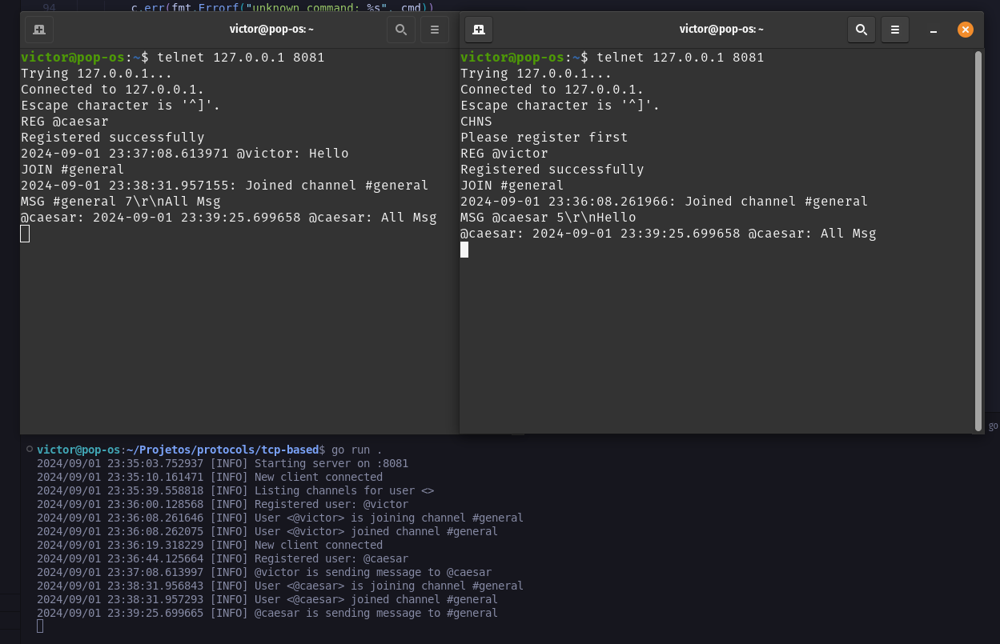
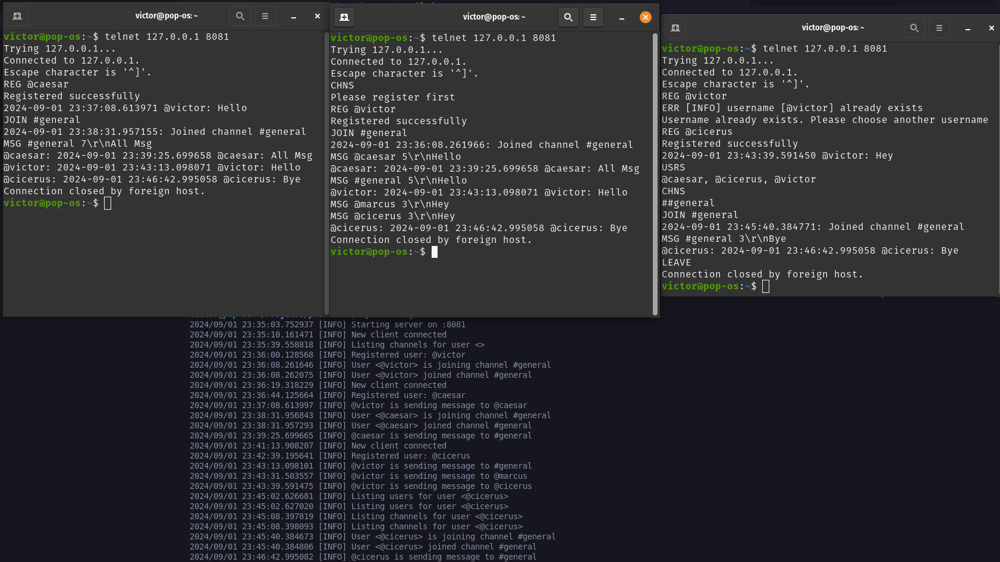

# Only a testing protocol written in Go

Text based protocol, built on top of TCP:

The advantage of a text based protocol is that a client can practically open a TCP connection to a server that implements the protocol and talk to it by sending ASCII characters.

## Commands:

| Command | Transmitter | Description                                               |
|---------|-------------|-----------------------------------------------------------|
| **REG** | Client      | Register as client                                        |
| **JOIN** | Client     | Join a channel                                            |
| **LEAVE** | Client    | Leave a channel                                           |
| **MSG** | Both        | Send or receive a message to/from entity (channel or user)|
| **CHNS** | Client     | List available channels                                   |
| **USRS** | Client     | List users                                                |
| **OK** | Server       | Command acknowledgement                                   |
| **ERR** | Server      | Error                                                     |


Syntax:

REG <user-name>
JOIN <channel-id>
LEAVE <channel-id>
LEAVE #general | LEAVE <channel-id>
MSG <entity-id> <length>\r\n[payload]

## Sending messages

### Structure of the 'MSG' command:

`MSG <entity-id> <length>\r\n[payload]`

Sending a message to @victor user:

`MSG @victor``\r\nHey!`

After sending the MSG command, the clients `handle` method will accept it.

## Testing

- From projects terminal run the project, this will be our server:
```bash
go run .
```

- On another terminal run:
```bash
telnet 127.0.0.1 8081
```

This will be the client.

Testing with 2 clients:



Or with 3 clients:


